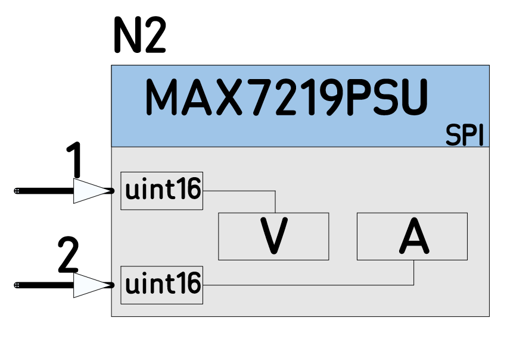

# 09D_MAX7219PSU_Test
Test Project for the Node **MAX7219PSU**

*  Single Node Design Translated and Compiled, to validate the new Node code :heavy_check_mark:

----
The single Node Schematic Design

----
The Design Translation 

----
The auto-generated main.cpp

----
Compiled

----

