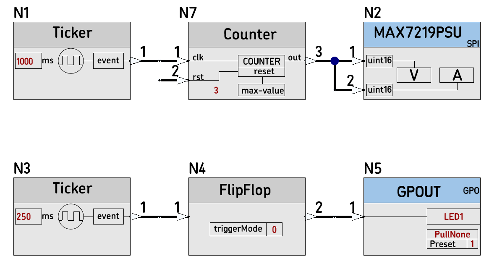

# 09D_MAX7219PSU_Test
C++ Test Project for the Node **MAX7219PSU**

Testing Log:
*  Single Node Design Translated and Compiled, to validate the new Node code :heavy_check_mark:
*  A 6 Nodes Design Created Translated and Compiled :heavy_check_mark:
*  The Design worked initially  with mbed LPC1768 board and a legacy 5-Digits-MAX7219-board :heavy_check_mark:
*  The Design worked succesfuly with of the shelf 8 digit boards :heavy_check_mark:

----
A test schematic Design with 6 Nodes :heavy_check_mark:

----
Counting to 3

----
The Design Translation 

----
The auto-generated main.cpp

----
Compiled

----
The 6 Nodes Design is Translated successfully with the nBlocksStudio Command Line Tool :heavy_check_mark:

----
The Auto generated main.cpp for the 6 Nodes Design, open in mbed-studio :heavy_check_mark:

----
Compilation with mbed-studio (setup for GCC) Complete :heavy_check_mark:

----
